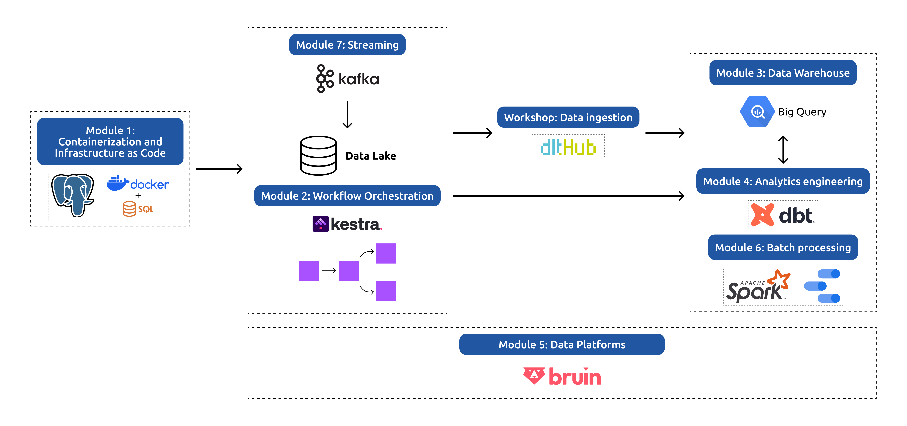

# Data Engineering Zoomcamp

This repository contains my notes, homework, and projects from the
[Data Engineering Zoomcamp 2026](https://github.com/DataTalksClub/data-engineering-zoomcamp/blob/main/README.md).

# Structure

**[Week 1 – Containerization & Infrastructure](01_docker_terraform)**
- 

- Containerized data ingestion pipelines and provisioned cloud infrastructure from scratch.

**[Week 2 – Workflow Orchestration](02_workflow_orchestration)**
- 

- Built and scheduled automated ETL pipelines pulling from APIs and files into cloud storage and warehouses.

**[Week 3 – Data Warehouse](03_data_warehouse)**
- 

- Designed and optimized analytical data models for large-scale querying.

**[Week 4 – Analytics Engineering](04-analytics-engineering)**
- 

- Transformed raw data into business-ready models using dimensional modeling best practices.

**[Week 5 – Data Platforms](05_data_platforms)**
- 

- Built end-to-end unified pipelines covering ingestion, transformation, and data quality.

**[Week 6 – Batch Processing](06-streaming)**
- 

- Processed large-scale datasets in distributed fashion using Spark's core abstractions.

**[Week 7 – Streaming](07_streaming)**
- 

- Built real-time data pipelines with event streaming and schema-governed message passing.

**[Final Project](https://github.com/liviaamaral/medicare-insights-pipeline)**
- 

- End-to-end data engineering project applying the full course stack, with peer review.